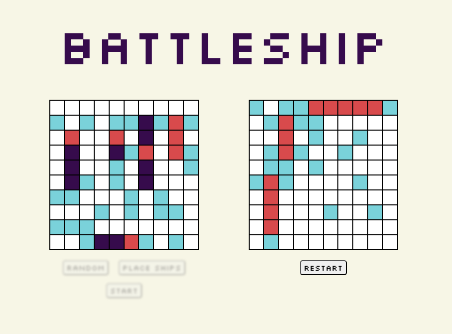

# Battleship project from The Odin Project

[live demo](https://evicno.github.io/odin-battleship/)

## Features

**Manual & Random Placement:** Choose to place your fleet manually using a Drag & Drop interface or generate a random board instantly.

**Smart Game Logic:** Built with a strictly decoupled architecture where the game engine and the UI are independent.

**Computer Opponent:** Play against a computer that makes automated moves.

**Official Rules:** Features the standard 5-ship fleet: Carrier (5), Battleship (4), Destroyer (3), Submarine (3), and Patrol Boat (2). Can't place ships right next to each other.

## Built With

**JavaScript (ES6):** Used Factory Functions and the Module Pattern for clean, encapsulated code.

**Jest:** Developed using **Test-Driven Development (TDD)** to ensure the reliability of the core game logic (Ship, Player and Gameboard).

**HTML5 / CSS3:** Utilized Flexbox, Data-Attributes, and Custom Properties for a dynamic and polished look.

**Webpack**

## Credits

<a href="https://www.freepik.com/icon/yacht_11574077#fromView=search&page=1&position=38&uuid=2b1c3340-9550-4299-8f19-9402ba22b1c3">Icon by IYIKON</a>
